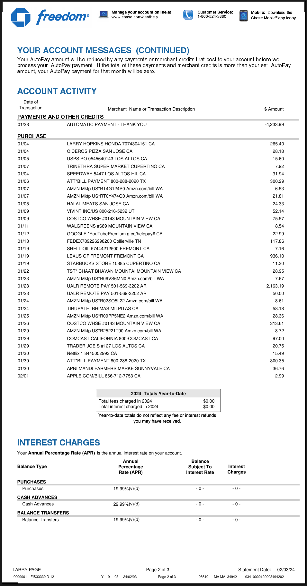

# PDF Table Extraction with LLMWhisperer and Langchain

This repository contains the code for the blog post [PDF Table Extraction and Processing
](https://unstract.com/blog/extract-table-from-pdf/). 

Tables are a very common form of representing dense information in various documents, especially in PDFs. Extracting tables from PDFs is a common task in many data science and machine learning projects. In this blog post, we will show you how to extract tables from PDFs using LLMWhisperer and Langchain.

## Supported operating systems
You should be able to run this on Linux or on a Mac. Windows is not supported.

## Keys you'll need
You'll need keys for OpenAI and [LLMWhisperer](https://unstract.com/llmwhisperer/), which you can get for free. Please read the blog post for more information. Once you have the keys, please add them to the `.env` file in the root of the project.

## Running the code
Clone this repo and change to the `llmwhisperer-table-extraction` directory. We suggest you run the code after you've created a Python virtual environment. You can create a virtual environment by running the following command:

```bash
python3 -m venv .venv
```

Next, activate the virtual environment:

```bash
source .venv/bin/activate
```

Now, install the dependencies:

```bash
pip install -r requirements.txt
```

Next, copy the `sample.env` file to `.env`, edit the `.env` file to add your OpenAI and LLMWhisperer keys:

```bash
cp sample.env .env
```

Finally, run the code:
    
```bash
python extract.py <path to the credit card statement PDF or directory with PDFs>
```

# Results

## Fetching spends from a credit card statement PDF

### Table of spends from a credit card statement PDF:


### Extracted raw text with LLMWhisperer:
```
                           Manage your account online at:     Customer Service:    Mobile: Download the 
                                        www.chase.com/cardhelp             1-800-524-3880       Chase Mobile ® app today 
         freedom 

  YOUR ACCOUNT MESSAGES (CONTINUED) 
 Your AutoPay amount will be reduced by any payments or merchant credits that post to your account before we 
 process your AutoPay payment. If the total of these payments and merchant credits is more than your set AutoPay 
 amount, your AutoPay payment for that month will be zero. 

  ACCOUNT ACTIVITY 

    Date of 
  Transaction                         Merchant Name or Transaction Description                        $ Amount 

 PAYMENTS AND OTHER CREDITS 
  01/28               AUTOMATIC PAYMENT - THANK YOU                                                   -4,233.99 

 PURCHASE 
  01/04               LARRY HOPKINS HONDA 7074304151 CA                                                 265.40 
 01/04                CICEROS PIZZA SAN JOSE CA                                                          28.18 
 01/05                USPS PO 0545640143 LOS ALTOS CA                                                    15.60 
 01/07                TRINETHRA SUPER MARKET CUPERTINO CA                                                 7.92 
  01/04               SPEEDWAY 5447 LOS ALTOS HIL CA                                                     31.94 
 01/06                ATT*BILL PAYMENT 800-288-2020 TX                                                  300.29 
 01/07                AMZN Mktp US*RT4G124P0 Amzn.com/bill WA                                             6.53 
  01/07               AMZN Mktp US*RT0Y474Q0 Amzn.com/bill WA                                            21.81 
  01/05               HALAL MEATS SAN JOSE CA                                                            24.33 
 01/09                VIVINT INC/US 800-216-5232 UT                                                      52.14 
  01/09               COSTCO WHSE #0143 MOUNTAIN VIEW CA                                                 75.57 
  01/11               WALGREENS #689 MOUNTAIN VIEW CA                                                    18.54 
  01/12               GOOGLE *YouTubePremium g.co/helppay# CA                                            22.99 
 01/13                FEDEX789226298200 Collierville TN                                                 117.86 
  01/19               SHELL OIL 57444212500 FREMONT CA                                                    7.16 
  01/19               LEXUS OF FREMONT FREMONT CA                                                       936.10 
 01/19                STARBUCKS STORE 10885 CUPERTINO CA                                                 11.30 
 01/22                TST* CHAAT BHAVAN MOUNTAI MOUNTAIN VIEW CA                                         28.95 
 01/23                AMZN Mktp US*R06VS6MNO Amzn.com/bill WA                                             7.67 
  01/23               UALR REMOTE PAY 501-569-3202 AR                                                  2,163.19 
  01/23               UALR REMOTE PAY 501-569-3202 AR                                                    50.00 
 01/24                AMZN Mktp US*R02SO5L22 Amzn.com/bill WA                                             8.61 
  01/24               TIRUPATHI BHIMAS MILPITAS CA                                                       58.18 
 01/25                AMZN Mktp US*R09PP5NE2 Amzn.com/bill WA                                            28.36 
 01/26                COSTCO WHSE #0143 MOUNTAIN VIEW CA                                                313.61 
  01/29               AMZN Mktp US*R25221T90 Amzn.com/bill WA                                             8.72 
  01/29               COMCAST CALIFORNIA 800-COMCAST CA                                                  97.00 
  01/29               TRADER JOE S #127 LOS ALTOS CA                                                     20.75 
 01/30                Netflix 1 8445052993 CA                                                            15.49 
 01/30                ATT*BILL PAYMENT 800-288-2020 TX                                                  300.35 
  01/30               APNI MANDI FARMERS MARKE SUNNYVALE CA                                              36.76 
 02/01                APPLE.COM/BILL 866-712-7753 CA                                                      2.99 

                                                2024 Totals Year-to-Date 
                                   Total fees charged in 2024                $0.00 
                                   Total interest charged in 2024            $0.00 
                                  Year-to-date totals do not reflect any fee or interest refunds 
                                                you may have received. 

 INTEREST CHARGES 
 Your Annual Percentage Rate (APR) is the annual interest rate on your account. 
                                            Annual                      Balance 
 Balance Type                              Percentage                  Subject To      Interest 
                                           Rate (APR)                 Interest Rate    Charges 

 PURCHASES 
    Purchases                            19.99%(v)(d)                     - 0 -          - 0 - 
 CASH ADVANCES 
    Cash Advances                       29.99%(v)(d)                      - 0 -          - 0 - 
 BALANCE TRANSFERS 
    Balance Transfers                    19.99%(v)(d)                     - 0 -          - 0 - 

LARRY PAGE                                            Page 2 of 3                          Statement Date: 02/03/24 
0000001 FIS33339 D 12               Y 9 03 24/02/03       Page 2 of 3      06610 MA MA 34942 03410000120003494202 
<<<
```

### Structured JSON output using Langchain + Pydantic
```
{
  "spend_items": [
    {
      "spend_date": "2024-01-04",
      "merchant_name": "LARRY HOPKINS HONDA 7074304151 CA",
      "amount_spent": 265.40
    },
    {
      "spend_date": "2024-01-04",
      "merchant_name": "CICEROS PIZZA SAN JOSE CA",
      "amount_spent": 28.18
    },
    {
      "spend_date": "2024-01-05",
      "merchant_name": "USPS PO 0545640143 LOS ALTOS CA",
      "amount_spent": 15.60
    },
    {
      "spend_date": "2024-01-07",
      "merchant_name": "TRINETHRA SUPER MARKET CUPERTINO CA",
      "amount_spent": 7.92
    },
    {
      "spend_date": "2024-01-04",
      "merchant_name": "SPEEDWAY 5447 LOS ALTOS HIL CA",
      "amount_spent": 31.94
    },
    {
      "spend_date": "2024-01-06",
      "merchant_name": "ATT*BILL PAYMENT 800-288-2020 TX",
      "amount_spent": 300.29
    },
    {
      "spend_date": "2024-01-07",
      "merchant_name": "AMZN Mktp US*RT4G124P0 Amzn.com/bill WA",
      "amount_spent": 6.53
    },
    {
      "spend_date": "2024-01-07",
      "merchant_name": "AMZN Mktp US*RT0Y474Q0 Amzn.com/bill WA",
      "amount_spent": 21.81
    },
    {
      "spend_date": "2024-01-05",
      "merchant_name": "HALAL MEATS SAN JOSE CA",
      "amount_spent": 24.33
    },
    [some items removed for concision]
  ]
}
```

## Fetching region-wise sales from 10-Q document

### Table of region-wise sales from a 10-Q document:


### Extracted raw text with LLMWhisperer:
```
Share-Based Compensation 
The following table shows share-based compensation expense and the related income tax benefit included in the Condensed 
Consolidated Statements of Operations for the three- and six-month periods ended March 30, 2024 and April 1, 2023 (in 
millions): 
                                                                 Three Months Ended             Six Months Ended 
                                                               March 30,       April 1,     March 30,       April 1, 
                                                                 2024           2023          2024           2023 
 Share-based compensation expense                            $      2,964 $        2,686 $       5,961   $      5,591 
Income tax benefit related to share-based compensation 
  expense                                                    $       (663) $       (620)        (1,898) $      (1,798) 

As of March 30, 2024, the total unrecognized compensation cost related to outstanding RSUs was $24.7 billion, which the 
Company expects to recognize over a weighted-average period of 2.7 years. 

Note 9 - Contingencies 
The Company is subject to various legal proceedings and claims that have arisen in the ordinary course of business and that 
have not been fully resolved. The outcome of litigation is inherently uncertain. In the opinion of management, there was not at 
least a reasonable possibility the Company may have incurred a material loss, or a material loss greater than a recorded accrual, 
concerning loss contingencies for asserted legal and other claims. 

Note 10 - Segment Information and Geographic Data 
The following table shows information by reportable segment for the three- and six-month periods ended March 30, 2024 and 
April 1, 2023 (in millions): 
                                                                 Three Months Ended             Six Months Ended 
                                                               March 30,       April 1,     March 30,       April 1, 
                                                                 2024           2023          2024           2023 
Americas: 
    Net sales                                                $     37,273 $      37,784 $       87,703   $     87,062 
     Operating income                                        $     15,074 $       13,927 $      35,431   $     31,791 

Europe: 
    Net sales                                                $     24,123 $       23,945 $      54,520   $     51,626 
    Operating income                                         $      9,991 $        9,368 $      22,702 $       19,385 

Greater China: 
    Net sales                                                $     16,372 $      17,812   $     37,191 $       41,717 
     Operating income                                        $      6,700 $        7,531 $      15,322   $     17,968 

Japan: 
    Net sales                                                $      6,262 $        7,176 $      14,029   $     13,931 
     Operating income                                        $      3,135 $        3,394 $       6,954   $      6,630 

 Rest of Asia Pacific: 
     Net sales                                               $      6,723 $        8,119 $      16,885   $     17,654 
    Operating income                                         $      2,806 $        3,268 $       7,385   $      7,119 

                                            Apple Inc. I Q2 2024 Form 10-Q | 11 
<<<
```

### Structured JSON output using Langchain + Pydantic
```
{
    "americas": [
        {
            "quarter_ending": "2024-03-30T00:00:00Z",
            "net_sales": 37273,
            "operating_income": 15074,
            "ending_type": "3-month"
        },
        {
            "quarter_ending": "2023-04-01T00:00:00Z",
            "net_sales": 37784,
            "operating_income": 13927,
            "ending_type": "3-month"
        },
        {
            "quarter_ending": "2024-03-30T00:00:00Z",
            "net_sales": 87703,
            "operating_income": 35431,
            "ending_type": "6-month"
        },
        {
            "quarter_ending": "2023-04-01T00:00:00Z",
            "net_sales": 87062,
            "operating_income": 31791,
            "ending_type": "6-month"
        }
    ],
    "europe": [
        {
            "quarter_ending": "2024-03-30T00:00:00Z",
            "net_sales": 24123,
            "operating_income": 9991,
            "ending_type": "3-month"
        },
        {
            "quarter_ending": "2023-04-01T00:00:00Z",
            "net_sales": 23945,
            "operating_income": 9368,
            "ending_type": "3-month"
        },
        {
            "quarter_ending": "2024-03-30T00:00:00Z",
            "net_sales": 54520,
            "operating_income": 22702,
            "ending_type": "6-month"
        },
        {
            "quarter_ending": "2023-04-01T00:00:00Z",
            "net_sales": 51626,
            "operating_income": 19385,
            "ending_type": "6-month"
        }
    ],
    "greater_china": [
        {
            "quarter_ending": "2024-03-30T00:00:00Z",
            "net_sales": 16372,
            "operating_income": 6700,
            "ending_type": "3-month"
        },
        {
            "quarter_ending": "2023-04-01T00:00:00Z",
            "net_sales": 17812,
            "operating_income": 7531,
            "ending_type": "3-month"
        },
        {
            "quarter_ending": "2024-03-30T00:00:00Z",
            "net_sales": 37191,
            "operating_income": 15322,
            "ending_type": "6-month"
        },
        {
            "quarter_ending": "2023-04-01T00:00:00Z",
            "net_sales": 41717,
            "operating_income": 17968,
            "ending_type": "6-month"
        }
    ],
    "japan": [
	"Some items removed for concision"
    ],
    "rest_of_asia_pacific": [
        "Some items removed for concision"
    ]
}
```